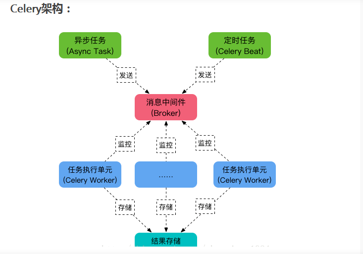

#### 1、使用这个项目，需要配置自己的settings.py中自己的邮箱配置

##### 0、直接使用sqlite3数据库，项目主要的技术点事在邮箱的注册和邮箱的确认上面，多注意看代码

```python
# 当前文件进行测试邮件发送
import os
from django.core.mail import send_mail
from django.core.mail import EmailMultiAlternatives

os.environ['DJANGO_SETTINGS_MODULE'] = 'login_reg.settings'

if __name__ == '__main__':

    # send_mail(
    #     '来自XuMou的测试邮件',
    #     '我在进行django小项目的总结',
    #     '发送邮箱@qq.com',
    #     ['接受邮箱@qq.com'],
    # )
    '''
    text_content是用于当HTML内容无效时的替代txt文本。
    '''
    subject, from_email, to = '来自XuMou的测试html邮件', '发送邮箱@qq.com', '接受邮箱@qq.com'
    text_content = '欢迎访问我的博客www.baidu.com'
    html_content = '<p>欢迎访问<a href="http://www.baidu.com" target=blank>www.baidu.com</a></p>'
    msg = EmailMultiAlternatives(subject, text_content, from_email, [to])
    msg.attach_alternative(html_content, "text/html")
    msg.send()
```

##### 如果要使用mysql数据库的话，需要执行下面几个步骤

###### 1、创建mysql数据用户，

```python
CREATE USER 'ming'@'%' IDENTIFIED BY '123456';

# 授权：
GRANT ALL ON *.* TO 'ming'@'%';
```

###### 2、项目点mysql数据库在settings.py的配置

```python
DATABASES = {
    'default': {
        'ENGINE': 'django.db.backends.mysql',
        'NAME': "login_reg",
        "USER": "ming",
        "HOST": "127.0.0.1",
        "PASSWORD": "123456",
        "PORT": 3306,
        'OPTIONS': {
            "init_command": "SET sql_mode='STRICT_TRANS_TABLES'",
        }

    }
}

```

###### 3、在项目的__init__.py文件加入mysql申明，不然回报mysql版本错误

```python
import pymysql
pymysql.version_info=(1,3,13,"final",0)
pymysql.install_as_MySQLdb()
```

###### 4、下载相关模块

```
pip3 install  mysqlclient 
```


###### ps:django的这验证码步骤

```python
第一步：
pip3 install django-multi-captcha-admin django-simple-captcha
第二步：配置settings.py
INSTALLED_APPS = [

    'django.contrib.auth',
    'django.contrib.contenttypes',
    'django.contrib.sessions',
    'django.contrib.messages',
    'django.contrib.staticfiles',
    'multi_captcha_admin',   # 一定将上面的剪切到这里
    'django.contrib.admin',  # 添加这个
    'captcha',              # # 添加这个

]
# 验证码配置
MULTI_CAPTCHA_ADMIN = {
    'engine': 'simple-captcha',
}
第三步：在项目路由添加验证码url
from django.contrib import admin
from django.urls import path,include

urlpatterns = [
    path('admin/', admin.site.urls),
    path('captcha/', include('captcha.urls')),  # 新增
]
第四步：数据库迁移
python3 manage.py makemigrations
python3 manage.py migrate
第五步：启动项目，访问admin登录界面


```

##### 2、使用celery来异步发送注册邮件

###### 001、第一步：下载celery安装包

```python
pip install celery==4.2.0 
```

###### 002、第一步：项目目录里新建一个celery的包celery_tasks

```python
项目文件夹新建celery的包celery_tasks，并在这个文件夹下新建一个文件
tasks.py 文件
然后进行创建celery实例
from celery import Celery
app = Celery('celery_tasks.tasks', broker='redis://127.0.0.1:6379/2')  # 使用redis数据库做中间人
# 定义任务函数
@app.task  # 装饰器，必不可少
def send_register_active_email(to_email, code):
    pass
```


###### 003、在tasks.py写上celery的任务函数

```python
# -*- coding: UTF-8 -*-
'''
=================================================
@Project -> File   ：login_reg -> tasks.py
@IDE    ：PyCharm
@Author ：XuMou
@Date   ：2020/8/10 12:49
==================================================
'''
from django.conf import settings
from django.core.mail import send_mail
from django.core.mail import EmailMultiAlternatives
from celery import Celery  # 导入celery包# 创建一个Celery类的实例对象

app = Celery('celery_tasks.tasks', broker='redis://127.0.0.1:6379/2')  # 使用redis数据库


# 定义任务函数
@app.task  # 装饰器，必不可少
def send_register_active_email(to_email, code):
    '''发送激活邮件'''
    '''
    这是之前没用celery进行邮件发送的 函数  在views.py视图函数也是存在的
    # 组织邮件信息
    # 发送邮件
    subject = "欢迎注册 XuMou'S "
    message = ''
    sender = settings.EMAIL_HOST_USER  # 发送邮件的账号
    receviver = [to_email]  # 收件人列表
    html_message = '<p>感谢注册我的博客<a href="http://{}/confirm/?code={}" target=blank>确认注册！</a></p><p>请点击链接完成注册!</p> <p>此链接有效期为{}天！</p>'.format(
        "127.0.0.1:8000", code, settings.CONFIRM_DAYS)
   
    
    '''

    # text_content是用于当HTML内容无效时的替代txt文本。
    subject = '来自XuMou项目的邮箱注册确认邮件'
    text_content = '如果你看到这条消息，说明你的邮箱服务器不提供HTML链接功能，请联系管理员！'

    # subject, from_email, to = '来自XuMou的邮箱注册确认邮件', '发送邮箱@qq.com', '接受邮箱@qq.com'

    html_content = '<p>感谢注册我的博客<a href="http://{}/confirm/?code={}" target=blank>确认注册！</a></p><p>请点击链接完成注册!</p> <p>此链接有效期为{}天！</p>'.format(
        "127.0.0.1:8000", code, settings.CONFIRM_DAYS)
    print("点击的地址是celery网站〉〉", html_content)
    '''

    <p>感谢注册我的博客<a href="http://127.0.0.1:8000/confirm/?code=None" target=blank></a>,</p><p>请点击下面的链接完成注册!</p> <p>此链接有效期为1天！</p>

    '''

    msg = EmailMultiAlternatives(subject, text_content, settings.EMAIL_HOST_USER, [to_email])
    msg.attach_alternative(html_content, "text/html")
    msg.send()

```

###### 004、在注册的函数路由中，使用定义的send_register_active_email 函数进行发送确认邮件

```python

def register(request):
    if request.session.get('is_login', None):
        return redirect('/index/')

    if request.method == 'POST':
        register_form = forms.RegisterForm(request.POST)
        message = "请检查填写的内容！"
        if register_form.is_valid():
            username = register_form.cleaned_data.get('username')
            password1 = register_form.cleaned_data.get('password1')
            password2 = register_form.cleaned_data.get('password2')
            email = register_form.cleaned_data.get('email')
            sex = register_form.cleaned_data.get('sex')

            if password1 != password2:
                message = '两次输入的密码不同！'
                return render(request, 'register.html', locals())
            else:
                same_name_user = User.objects.filter(name=username)
                if same_name_user:
                    message = '用户名已经存在'
                    return render(request, 'register.html', locals())
                same_email_user = User.objects.filter(email=email)
                if same_email_user:
                    message = '该邮箱已经被注册了！'
                    return render(request, 'register.html', locals())

                new_user = User()
                new_user.name = username
                new_user.password = hash_code(password1)
                new_user.email = email
                new_user.sex = sex
                new_user.save()

                code = make_confirm_string(new_user)  # 确认
                print("确认码为〉〉",code)

                # ==================== send_email(email, code) ====================
                # 使用celery进行异步发送注册确认确认
                from celery_tasks.tasks import send_register_active_email  # 导入celery发邮件的方法
                send_register_active_email(email,code)
                message = '请前往邮箱进行确认！'
                return render(request, 'confirm.html', locals())
        else:
            return render(request, 'register.html', locals())
    register_form = forms.RegisterForm()
    return render(request, 'register.html', locals())

```

###### 005、启动celery之前安装 redis

```python
pip install -U "celery[redis]"
```

命令行界面启动celery，然后启动项目，注册时候就可以发送邮件了

```python
celery -A celery_tasks.tasks worker -l info
```




#### 3、使用social_djang集成第三方登录

##### 001、使用微博来登录

###### 第一步：**申请应用**

```
进入微博开放平台，首先要经过认证，然后才可以创建应用

 地址：http://open.weibo.com/authentication
```

**创建应用**


获取App Key


但是还未认证，所以先用测试信息登录


高级信息设置


第二步：用social_django第三方库来实现第三方登录

（1） 安装

```
pip install social-auth-app-django
```

（2）INSTALL_APP中配置

```
'social_django',
```

（3）生成表，只需要做migrate，因为migration的文件已经生成好了

```
python manage.py migrate
```

可能会报错

```python
django.db.utils.IntegrityError: The row in table 'login_confirmstring' with primary key '9' has an invalid foreign key: login_confirmstring.user_id contains a
value '11' that does not have a corresponding value in login_user.id.
```


解决方案：我删库了，删了user下报错的table里的数据据信息

多了五张表


（4） 添加到`AUTHENTICATION_BACKENDS中`

​	settings

```python
# 设置邮箱和用户名和手机号均可登录
AUTHENTICATION_BACKENDS = (
    'users.views.CustomBackend',
    'social_core.backends.weibo.WeiboOAuth2',
    'social_core.backends.qq.QQOAuth2',
    'social_core.backends.weixin.WeixinOAuth2',
    'django.contrib.auth.backends.ModelBackend',
)
```

（5）配置url

```python
# 第三方登录
path('', include('social_django.urls', namespace='social'))
```

（6）settings里面context_processors

对于template中的用法，向context_processors中加入下面两个

```python
　'social_django.context_processors.backends',
  'social_django.context_processors.login_redirect',
```


（7）接口

微博开放平台里面设置回调url，调试的时候设置成本地的就可以了，上线的时候改成服务器的ip地址


ps:如果出现报错，请检查你的测试账号是不是自己的账号

```
出现下面的重定向地址不匹配
```


则到  应用信息 的 **OAuth2.0 授权设置**     授权回调页，不要忘记最后的斜杠

```python

http://127.0.0.1:8000/complete/weibo       # 错误 会报错上面的错误
        
http://127.0.0.1:8000/complete/weibo/      # 正确 加上斜杠 / ,并且测试账号是不是自己创建的账号

```

正确的页面是


（8）APP Secret和App key配置，settings里面

```python
# 第三方登录，里面的值是你的开放平台对应的值
SOCIAL_AUTH_WEIBO_KEY = 'xxxxxxx'    # 微博的
SOCIAL_AUTH_WEIBO_SECRET = 'xxxxxx'

SOCIAL_AUTH_QQ_KEY = 'xxxxxxx'		# qq的
SOCIAL_AUTH_QQ_SECRET = 'xxxxxxx'

SOCIAL_AUTH_WEIXIN_KEY = 'xxxxxxx'		# 微信的
SOCIAL_AUTH_WEIXIN_SECRET = 'xxxxxxx'
```

现在浏览器访问：http://127.0.0.1:8000/login/weibo,就可以登录了，我们还需要设置用户微博登录成功后跳转到首页


（9）修改源码

```python
Lib/site-packages/social_core/actions  下的 132行
修改为：
response = backend.strategy.redirect(url)
payload = jwt_payload_handler(user)
response.set_cookie("name", user.name if user.name else user.username, max_age=24 * 3600)
response.set_cookie("token", jwt_encode_handler(payload), max_age=24 * 3600)
```

（10）登录的话，后端使用 登录

````python
http://127.0.0.1:8000/login/weibo/  
````


（11）扫码登录后，就可以登录到index，页面，但是我这个案例是在index有判断token的，所以需要修改一下

